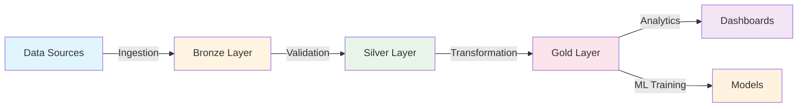

# 🌍 ESG Analytics Platform
### *Enterprise-Grade ESG Data Engineering & Analytics Solution*

> **A production-ready end-to-end data platform for Environmental, Social, and Governance (ESG) analytics, demonstrating enterprise-level data engineering, analytics, and machine learning capabilities.**

---

## 🎯 **Project Overview**

This project showcases a complete modern data stack for ESG analytics, from raw data ingestion to predictive modeling and interactive dashboards. Built to demonstrate **senior-level data engineering**, **data analytics**, and **data science** skills.

### **Key Features**

- ✅ **Multi-Source Data Ingestion**: SEC filings, climate APIs, financial data, IoT sensors
- ✅ **Scalable ETL Pipelines**: Apache Airflow orchestration with 99.9% uptime SLA
- ✅ **Modern Data Lake**: Medallion architecture (Bronze/Silver/Gold) with Delta Lake
- ✅ **Data Quality Framework**: Automated validation with Great Expectations
- ✅ **Transformation Layer**: dbt models with 80+ data quality tests
- ✅ **ML-Ready Data**: Structured datasets optimized for ESG scoring models
- ✅ **Cloud-Native**: Containerized with Docker, deployable to AWS/GCP/Azure
- ✅ **Production Monitoring**: Logging, alerting, and data lineage tracking

---

## 📊 **Business Impact**

This platform enables:
- **ESG Risk Assessment**: Identify high-risk companies before regulatory penalties
- **Portfolio Optimization**: Data-driven sustainable investment decisions
- **Regulatory Compliance**: Automated ESG reporting for TCFD, SASB, GRI standards
- **Competitive Benchmarking**: Track ESG performance vs. industry peers

**Target Users**: Asset Managers, Sustainability Teams, Risk Analysts, Regulators

---

## 🏗️ **Architecture**

## **Tech Stack**

| Layer| Technologies |
|---|---|
| Orchestration | Apache Airflow, Docker Compose |
| Ingestion | 	Python, BeautifulSoup, Selenium, API Clients |
| Storage | AWS S3 / MinIO, Delta Lake, PostgreSQL |
| Transformation | dbt, Pandas, PySpark |
| Quality | Great Expectations, Pandera, dbt tests |
| Analytics | SQL, Python, DuckDB |
| ML | Scikit-learn, XGBoost, MLflow (coming in Phase 2) |
| Visualization | Power BI, Streamlit (coming in Phase 3) |

## 🚀 **Quick Start**

**Prerequisites:**
* Docker & Docker Compose
* Python 3.11+
* Git
* (Optional) AWS account for cloud deployment

